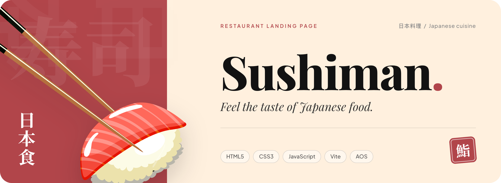
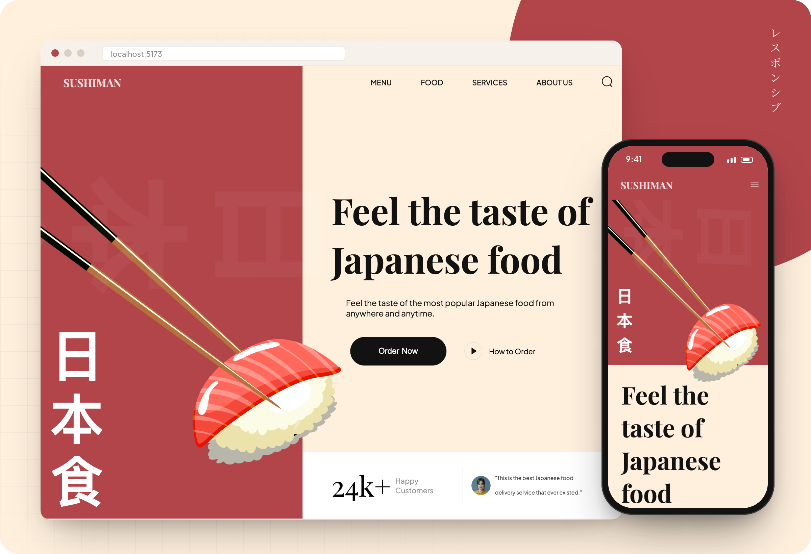
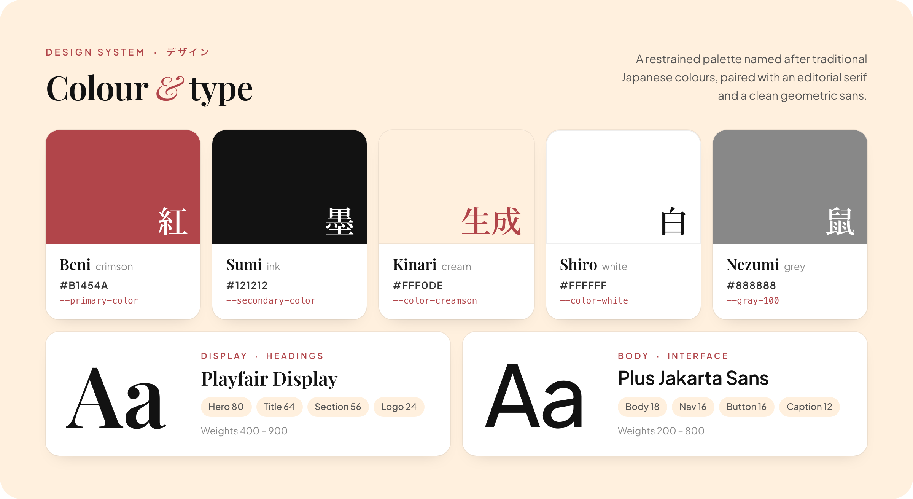
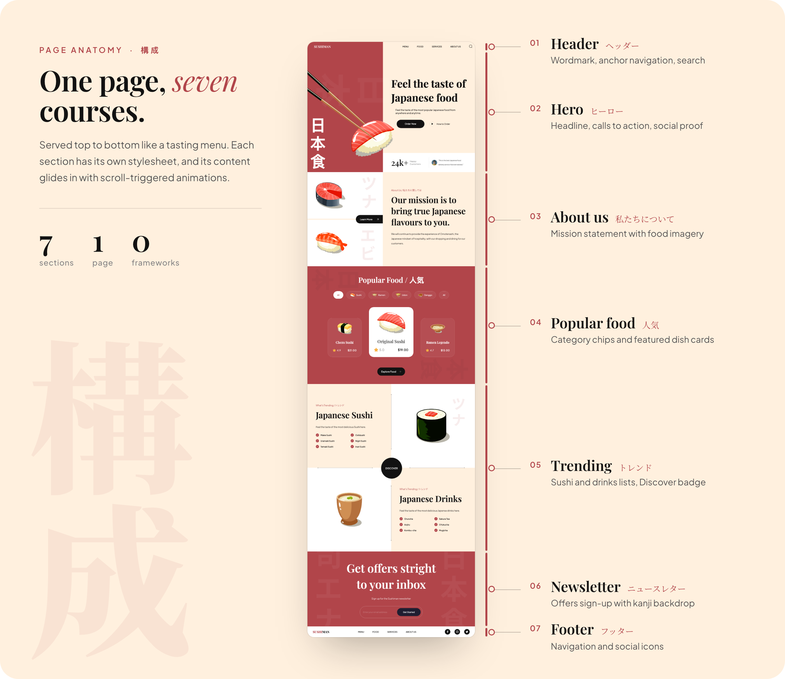

<a id="top"></a>

<p align="center">
  
</p>

<p align="center">
  <b>A responsive landing page for a Japanese restaurant.</b><br />
  <sub>Semantic HTML &nbsp;·&nbsp; modular CSS &nbsp;·&nbsp; vanilla JavaScript &nbsp;·&nbsp; bundled with Vite</sub>
</p>

<p align="center">
  
  
  
  
  
</p>

<p align="center">
  <a href="#preview">Preview</a> &nbsp;·&nbsp;
  <a href="#design-system">Design system</a> &nbsp;·&nbsp;
  <a href="#page-anatomy">Page anatomy</a> &nbsp;·&nbsp;
  <a href="#getting-started">Getting started</a> &nbsp;·&nbsp;
  <a href="#project-structure">Structure</a> &nbsp;·&nbsp;
  <a href="#roadmap">Roadmap</a>
</p>

<br />

## Preview

<p align="center">
  
</p>

<table>
  <tr>
    <td width="33%" valign="top">
      <b>Responsive by design</b><br />
      <sub>Layouts reflow across five breakpoints, from a 1280&nbsp;px desktop canvas down to 390&nbsp;px phones.</sub>
    </td>
    <td width="33%" valign="top">
      <b>Motion with restraint</b><br />
      <sub>Content fades, flips and zooms into view with one-second <a href="https://michalsnik.github.io/aos/">AOS</a> transitions as you scroll.</sub>
    </td>
    <td width="33%" valign="top">
      <b>Modular styles</b><br />
      <sub>Shared tokens live in one global stylesheet; each section has its own focused CSS file.</sub>
    </td>
  </tr>
</table>

<br />

## Design system

<p align="center">
  
</p>

The visual language pairs a warm crimson and cream palette with an editorial serif. Japanese characters are used as oversized, low-opacity backdrops, so they add texture without competing with the content.

<details>
<summary><b>Design tokens</b> — core CSS custom properties from <a href="css/style.css"><code>css/style.css</code></a></summary>
<br />

| Token | Value | Role |
| :--- | :--- | :--- |
| `--primary-color` | `#b1454a` | Brand crimson: panels, accents, subtitles |
| `--secondary-color` | `#121212` | Headings, text and primary buttons |
| `--color-creamson` | `#fff0de` | Page background |
| `--color-white` | `#ffffff` | Cards and content panels |
| `--gray-100` | `#888888` | Ratings and secondary text |
| `--playfair-display` | Playfair Display | Display type: hero, section titles, wordmark |
| `--plus-jakarta-sans` | Plus Jakarta Sans | Body copy, navigation, buttons |

</details>

<br />

## Page anatomy

<p align="center">
  
</p>

<details>
<summary><b>Section reference</b> — where each part lives in the code</summary>
<br />

| # | Section | Anchor | Stylesheet |
| :-: | :--- | :--- | :--- |
| 01 | Header | — | [`header.css`](css/sections/header.css) |
| 02 | Hero | — | [`hero.css`](css/sections/hero.css) |
| 03 | About us | `#about-us` | [`about.css`](css/sections/about.css) |
| 04 | Popular food | `#menu` | [`popular.css`](css/sections/popular.css) |
| 05 | Trending sushi & drinks | `#food` | [`trending.css`](css/sections/trending.css) |
| 06 | Newsletter | `#services` | [`subscribe.css`](css/sections/subscribe.css) |
| 07 | Footer | — | [`footer.css`](css/sections/footer.css) |

All markup and copy is in [`index.html`](index.html). Elements opt into scroll animations with `data-aos` attributes, and AOS is initialised in [`js/script.js`](js/script.js).

</details>

<br />

## Getting started

You need [Node.js](https://nodejs.org/) (a current LTS release) and npm.

```bash
git clone https://github.com/FilipKalcic1/sushi-website-frontend.git
cd sushi-website-frontend
npm ci
npm run dev
```

Vite serves the site at **http://localhost:5173** with hot module replacement. To open it from another device on the same network, run `npm run dev -- --host`.

| Command | What it does |
| :--- | :--- |
| `npm ci` | Install the exact dependency tree from `package-lock.json` |
| `npm run dev` | Start the Vite dev server |
| `npm run build` | Build the optimised static site into `dist/` |
| `npm run preview` | Serve the latest `dist/` build locally |

### Deployment

The build is fully static, with no backend or environment variables. Upload `dist/` to any static host, such as Netlify, Vercel or GitHub Pages. For hosts that serve from a sub-path (for example GitHub Pages project sites), set Vite's [`base`](https://vitejs.dev/config/shared-options.html#base) option before building.

<br />

## Project structure

```text
sushi-website-frontend/
├── index.html            # All markup and copy for the single page
├── css/
│   ├── style.css         # Design tokens, shared helpers, section imports
│   └── sections/         # One stylesheet per page section
├── js/
│   └── script.js         # AOS initialisation and bundled asset imports
├── assets/               # Food illustrations, backgrounds and SVG icons
├── public/               # Copied to dist/ as-is (favicon)
└── .github/readme/       # Images used in this README
```

<br />

## Roadmap

The site is currently a front-end showcase: the content is static and the controls are visual only. Next steps:

- [ ] Filter the dish cards with the category chips
- [ ] Open a navigation drawer from the mobile menu icon
- [ ] Add a search overlay
- [ ] Validate and submit the newsletter form
- [ ] Link the calls to action and social icons
- [ ] Render the menu cards from the data already defined in `js/script.js`

<details>
<summary><b>Contributing</b></summary>
<br />

1. Create a branch for your change.
2. Keep content in `index.html`, shared styles in `css/style.css` and section styles in `css/sections/`.
3. Run `npm run build && npm run preview` and check the page at desktop and mobile widths, including anchors, images and animations.

</details>

<br />

<p align="center">
  
</p>

<p align="center">
  <sub><b>ごちそうさまでした</b> &nbsp;·&nbsp; Thanks for stopping by.</sub><br />
  <sub>Crafted by <a href="https://github.com/FilipKalcic1">Filip Kalcic</a> &nbsp;·&nbsp; <a href="#top">Back to top ↑</a></sub>
</p>
