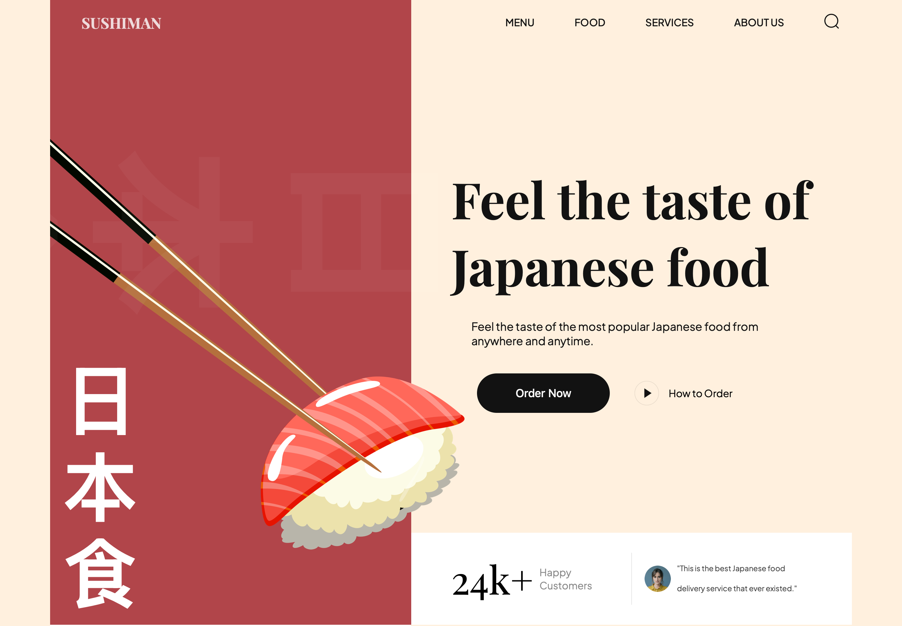

# Sushiman

A responsive restaurant landing page presenting Japanese food, drinks, and the Sushiman brand. The site is built with semantic HTML, section-based CSS, and vanilla JavaScript, with Vite providing the local development server and production build.

## Website Preview

<p align="center">
	<strong>Desktop - 1440 x 1000</strong>
	&nbsp;&nbsp;&nbsp;&nbsp;
	<strong>Mobile - 390 x 844</strong>
</p>
<p align="center">
	
	&nbsp;&nbsp;
	
</p>

The interface is currently a static front-end showcase. It does not connect to an ordering service, search provider, newsletter platform, or other backend.

## Contents

- [Highlights](#highlights)
- [Page sections](#page-sections)
- [Technology](#technology)
- [Project structure](#project-structure)
- [Requirements](#requirements)
- [Run locally](#run-locally)
- [Available commands](#available-commands)
- [Production build](#production-build)
- [Deployment](#deployment)
- [Design and assets](#design-and-assets)
- [Current scope and limitations](#current-scope-and-limitations)
- [Contributing](#contributing)

## Highlights

- Responsive layouts for desktop and smaller screens, implemented with CSS media queries.
- A single-page restaurant experience with in-page navigation.
- Scroll-triggered entrance animations powered by [AOS](https://michalsnik.github.io/aos/).
- Styles organized into global rules and focused section files.
- Food photography, illustrations, and interface icons stored locally in the repository.
- A Vite production build that bundles imported JavaScript dependencies and assets.

## Page sections

The page content is defined in [`index.html`](index.html):

| Section | Description |
| --- | --- |
| Header | Sushiman wordmark and links to the menu, food, services, and about sections. |
| Hero | Introductory headline, Japanese food image, calls to action, and a testimonial-style panel. |
| About | Brand mission and supporting food imagery. |
| Popular food | A category-style filter bar and featured food cards with ratings and prices. |
| Trending | Featured Japanese sushi and drink lists with supporting imagery. |
| Services | Newsletter sign-up presentation. |
| Footer | In-page navigation and social network icons. |

The header and footer links navigate to page sections using HTML anchors. Elements such as the search icon, mobile menu icon, food filters, order buttons, and newsletter form are currently visual interface elements; they do not perform a search, open a working menu, filter products, place orders, or submit email addresses.

## Technology

- **HTML5** for page structure and content.
- **CSS3** for layout, responsive behavior, typography, and section-specific presentation.
- **JavaScript ES modules** for browser-side code and dependency imports.
- **[Vite](https://vitejs.dev/)** for development and static production builds.
- **[AOS](https://michalsnik.github.io/aos/)** for scroll-triggered animations.
- **npm** for dependency installation and project scripts.

The project does not use a front-end framework or a server-side application. Its direct dependencies are declared in [`package.json`](package.json), with exact resolved versions recorded in `package-lock.json`.

## Project structure

```text
.
├── assets/                  # Food imagery, backgrounds, and SVG icons
├── css/
│   ├── style.css            # Global styles, CSS variables, and section imports
│   └── sections/            # Header, hero, about, menu, trending, etc.
├── js/
│   └── script.js            # AOS setup and browser-side module imports
├── public/                  # Files copied to the build output as-is
├── index.html               # Single-page application entry point and content
├── package.json             # Dependencies and npm scripts
└── package-lock.json        # Reproducible npm dependency versions
```

### Key files

- [`index.html`](index.html) contains the page markup and text.
- [`css/style.css`](css/style.css) defines shared CSS variables and imports the individual section stylesheets.
- [`css/sections/`](css/sections/) contains the component-like styles for each page area.
- [`js/script.js`](js/script.js) initializes AOS and imports the assets and library styles needed by the JavaScript entry point.
- [`public/`](public/) contains public files, including the site favicon. Vite copies this directory into the production output without processing its contents.

## Requirements

- [Node.js](https://nodejs.org/) and npm. Use a currently supported Node.js LTS release for local development.
- Git, if cloning the repository.

Vite 4 supports Node.js versions compatible with its engine requirement. If npm reports an unsupported Node.js version, upgrade Node.js before installing dependencies.

## Run locally

Clone the repository and move into the project directory:

```bash
git clone https://github.com/FilipKalcic1/sushi-website.git
cd sushi-website
```

Install the exact dependency tree from the lockfile, then start the development server:

```bash
npm ci
npm run dev
```

Vite prints the local URL in the terminal. By default, it is `http://localhost:5173/`. Open that address in a modern browser. The dev server supports hot module replacement while editing HTML, CSS, and JavaScript.

To expose the dev server to other devices on the same network, run:

```bash
npm run dev -- --host 0.0.0.0
```

## Available commands

| Command | Purpose |
| --- | --- |
| `npm ci` | Install dependencies from `package-lock.json`. |
| `npm run dev` | Start the Vite development server. |
| `npm run build` | Generate the optimized static production site in `dist/`. |
| `npm run preview` | Serve the latest `dist/` build locally for review. |

The project currently has no automated test, lint, or formatting scripts configured in `package.json`.

## Production build

Create a production build with:

```bash
npm run build
```

Vite writes the deployable site to `dist/`. To inspect that build locally before deployment, run:

```bash
npm run preview
```

The preview server is for local verification, not a production hosting server. Build output is generated and should not be edited by hand; make source changes in `index.html`, `css/`, `js/`, or `assets/`, then rebuild.

## Deployment

This is a static site and does not require a backend or environment variables. Deploy the contents of `dist/` to a static hosting provider such as Netlify, Vercel, or a web server configured to serve static files.

For GitHub Pages or another host that serves the site from a repository subpath, configure Vite's `base` option to match that subpath before building. The current project does not include a `vite.config.js` with a custom base path, so the default root-path build is intended for a domain or host root.

Whenever the source changes, generate a fresh build and deploy the newly generated `dist/` directory.

## Design and assets

Shared colors, typography, and layout helpers are defined in [`css/style.css`](css/style.css). Section-specific rules are kept in separate files under `css/sections/`; responsive adjustments are also included in the stylesheet imports.

Images and icons are stored in `assets/`. Assets referenced directly from HTML use public URLs, while assets imported from JavaScript are resolved and bundled by Vite. Files in `public/` are served from the site root and copied into `dist/` as-is.

Scroll animations are configured in [`js/script.js`](js/script.js). Elements opt into AOS by using `data-aos` attributes in the HTML.

## Current scope and limitations

- Menu items, product cards, ratings, and prices are presentation content rather than data loaded from an API.
- The category controls do not currently filter the visible products.
- Order, learn-more, explore, and how-to-order calls to action have no connected destination or workflow.
- The search and mobile menu icons have no implemented interaction.
- The newsletter area has no form submission handler or email-service integration.
- The social icons are decorative and are not linked to social profiles.
- Some sample data constants are present in the JavaScript entry point, but the visible page content is authored in HTML.

These behaviors can be connected to real services or implemented as client-side interactions in a future iteration.

## Contributing

1. Create a branch for the change.
2. Keep content in `index.html`, shared presentation in `css/style.css`, and section-specific presentation in `css/sections/`.
3. Use the existing npm scripts to build and verify changes:

	```bash
	npm ci
	npm run build
	npm run preview
	```

4. Check the page at desktop and mobile viewport sizes, and verify that local images, navigation anchors, and animations load as expected.

## License

No license file is currently included in the repository. Add a license before redistributing this project if specific reuse terms are required.
